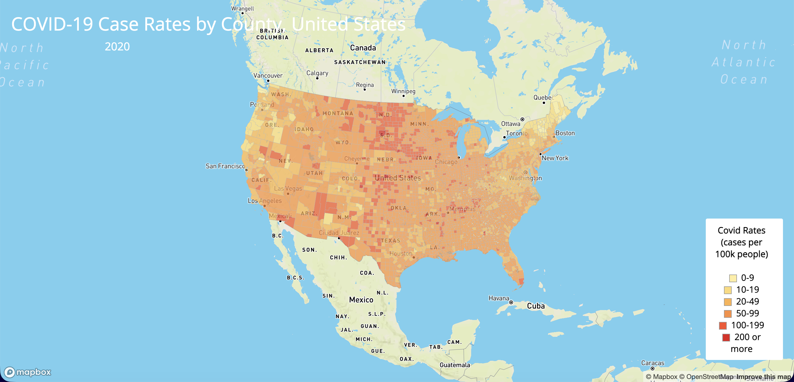
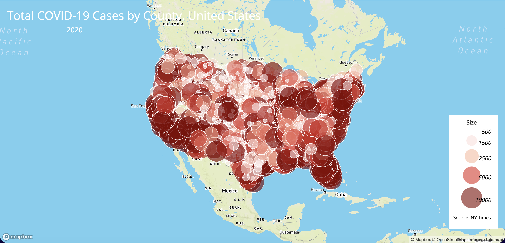

# COVID-19 Thematic Map of the United States (2020)
## Project Overview

This project focused on the COVID-19 pandemic in the US in 2020 and presened two representative maps. 

---
## Maps
### 1. COVID-19 Case Rates by County, United States (2020)
- **Map type:** Choropleth map  
- **Variable:** COVID-19 case rate (cases per 1,000 residents)  
- **Spatial unit:** County  
- **File:** `map1.html`  
- **URL:**  `https://yuanfw-ops.github.io/us-covid-2020/Map1.html`

This map visualized the overall rate of COVID-19 by US counties, which was calculated by cases per 1000 residents. 

### 2. Total COVID-19 Cases by County, United States (2020)

- **Map type:** Proportional symbol map  
- **Variable:** Total confirmed COVID-19 cases  
- **Spatial unit:** County  
- **File:** `map2.html`  
- **URL:**  `https://yuanfw-ops.github.io/us-covid-2020/Map2.html`

This map tells the total number of cases of COVID-19 by counties. 

---

## Data Sources

- **COVID-19 case data:** [The New York Times COVID-19 dataset (county level, 2020)](https://github.com/nytimes/covid-19-data/blob/43d32dde2f87bd4dafbb7d23f5d9e878124018b8/live/us-counties.csv)
- **Population data:** [2018 American Community Survey (ACS) 5-year estimates](https://data.census.gov/cedsci/table?g=0100000US.050000&d=ACS%205-Year%20Estimates%20Data%20Profiles&tid=ACSDP5Y2018.DP05&hidePreview=true)
- **County boundaries:** [U.S. Census Bureau](https://data.census.gov/cedsci/table?g=0100000US.050000&d=ACS%205-Year%20Estimates%20Data%20Profiles&tid=ACSDP5Y2018.DP05&hidePreview=true)

---

## Data Processing

- Converted original dataset to **GeoJSON** from **Shapefile**. 
- Maps are rendered using the **Albers projection** in Mapbox GL JS. 

---

## Acknowledgement & Credits
- Lab materials and processed datasets provided by **Steven Bao**
- Lab instruction by **Bo Zhao**

---